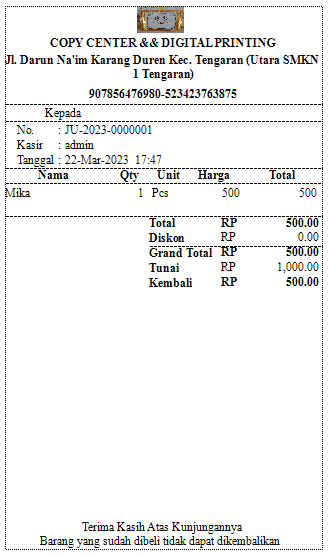

## Sistem Informasi Penjualan

Berikut ini merupakan aplikasi penjualan berbasis desktop dengan webservice, yang mana terdapat fitur-fitur yang flexibel.

<h2>Module Master</h2>

- Terdapat kategori penjualan barang dan jasa.
- Terdapat fasilitas untuk setting consumtion untuk jasa.

<h2>Module Transaksi</h2>

- Terdapat fasilitas pencatatan pemasukan barang dan akan berpengaruh ke stok barang.

- Terdapat fasilitas penjualan barang dan jasa yang akan berpengaruh pada stok barang.

- Pada transaksi penjualan bisa memproses penjualan jasa secara custom item, seperti contohnya "Cetak Makalah" yang terdiri dari item Kertas Cover, Mika, Lem.

- Terdapat fasilitas untuk cetak struck penjualan.

- Terdapat fasilitas Return Out, untuk mengembalikan barang ke supplier atau untuk mengeluarkan barang yang rusak dari stok tanpa mengembalikan ke supplier dengan sistem inhouse.

- Terdapat fasilitas Return In, untuk mengembalikan barang yang sudah terjual, agar masuk ke stok kembali.

<h2>Module Report</h2>

- Terdapat berbagai macam report, salah satunya report keuangan.

<h2>Module Setting</h2>

- Terdapat berbagai macam fitur untuk setting Login user dan data perusahaan.
